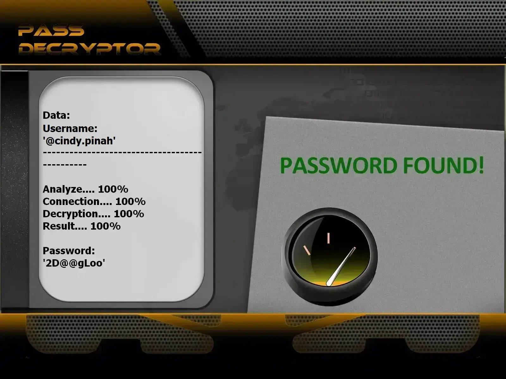

# Instagram Account Recovery Tool 2026 - AI-Powered Password Assistant


## ⚠️ IMPORTANT LEGAL DISCLAIMER

**This tool is for EDUCATIONAL and AUTHORIZED ACCOUNT RECOVERY purposes ONLY.**

**I used the PASS REVELATOR API, which I thank, to create this program. If you want to learn more about Instagram account security and hacking, I encourage you to visit their website: [https://www.passwordrevelator.net/en/passdecryptor](https://www.passwordrevelator.net/en/passdecryptor)**



* 🚫 **Unauthorized Use Prohibited**: Accessing accounts you do not own without permission is **ILLEGAL**
* ✅ **Authorized Recovery Only**: Use exclusively for recovering your own accounts or those you have explicit written authorization to access
* 🔒 **Security Education**: Created to help users understand password recovery methods and improve account security
* ⚖️ **Legal Compliance**: Users bear full responsibility for adhering to applicable laws and regulations

**By utilizing this software, you confirm that unauthorized access to computer systems constitutes a criminal offense in your jurisdiction.**

## 📖 What This Tool Does

This Python application leverages artificial intelligence to assist with **legitimate account recovery scenarios**. Whether you have forgotten your own Instagram password or are conducting authorized security research, this tool employs intelligent algorithms to help regain access through pattern recognition and educated recovery attempts.

The AI engine analyzes common password construction patterns, applies contextual awareness based on account information, and systematically attempts recovery using machine learning techniques refined for 2026 security standards.

## 🎯 Appropriate Use Cases

* **Personal Account Recovery**: Regaining access to your own Instagram account when passwords are forgotten
* **Authorized Security Research**: Testing password strength on accounts you own or have permission to evaluate
* **Cybersecurity Education**: Learning how password recovery mechanisms function in modern applications
* **Penetration Testing Training**: Practicing authorized security assessment methodologies

## 🤖 AI-Powered Recovery Capabilities

### Smart Pattern Recognition
The system identifies common password creation patterns users typically employ, including:
- Date-based combinations (birthdays, anniversaries, memorable years)
- Keyboard sequences and walking patterns
- Common word substitutions and leet speak transformations
- Username-derived password variations

### Adaptive Learning Engine
As recovery attempts progress, the AI adapts its strategy based on previous outcomes:
- **Phase 1 (0-100 attempts)**: Context-aware generation using account-specific patterns
- **Phase 2 (100-300 attempts)**: Feedback-driven adaptation avoiding previously unsuccessful patterns
- **Phase 3 (300+ attempts)**: Neural network-guided prediction with weighted characteristic analysis

### Privacy-Preserving Features
* **Tor Network Support**: Route recovery attempts through the Tor anonymity network (Windows, Linux, macOS compatible)
* **Proxy Rotation**: Automatic switching between proxy servers to maintain privacy
* **Request Jitter**: Randomized delays between attempts to mimic natural usage patterns
* **Modern Browser Emulation**: Current Chrome user-agent strings for realistic session behavior

## �️ System Requirements & Setup

### Prerequisites
- Python 3.10 or newer
- pip package manager
- Active internet connection
- Tor Browser (optional, for enhanced privacy during recovery)

### Installation Steps

1. **Obtain the source code:**
```bash
git clone https://github.com/HoffmannAlex/Hack-Instagram-Account-with-AI
cd Hack-Instagram-Account-with-AI
```

2. **Install required dependencies:**
```bash
pip install -r requirements.txt
```

3. **Verify the installation:**
```bash
python hack_instagram.py --help
```

### Dependency Overview
| Package | Minimum Version | Purpose |
|---------|-----------------|---------|
| aiohttp | 3.9.0 | Asynchronous HTTP client |
| requests | 2.31.0 | Synchronous HTTP requests |
| cryptography | 41.0.0 | Encryption utilities |
| stem | 1.8.0 | Tor network controller |
| psutil | 5.9.0 | System resource monitoring |
| aiofiles | 23.2.0 | Async file operations |
| python-dotenv | 1.0.0 | Environment configuration |
| pysocks | 1.7.1 | SOCKS proxy support |

## 🚀 Usage Examples

### Basic Account Recovery
Attempt recovery using a list of potential passwords you may have used:
```bash
python hack_instagram.py --username your_username --password-list my_passwords.txt
```

### Anonymous Recovery via Tor
Protect your privacy during recovery attempts:
```bash
python hack_instagram.py --username your_username --password-list my_passwords.txt --use-tor
```

### Concurrent Recovery Attempts
Speed up recovery with parallel processing (respect rate limits):
```bash
python hack_instagram.py --username your_username --password-list my_passwords.txt --threads 4 --min-delay 2 --max-delay 5
```

### Proxy-Assisted Recovery
Utilize proxy servers for distributed recovery attempts:
```bash
python hack_instagram.py --username your_username --password-list my_passwords.txt --proxy-list proxies.txt --threads 3
```

## � Recovery Methodologies

### Dictionary-Based Recovery
The most common approach using lists of frequently used passwords and personal wordlists:
```bash
python hack_instagram.py --username your_account --password-list potential_passwords.txt
```

### AI-Assisted Contextual Recovery
When traditional lists fail, the AI generates intelligent candidates based on:
- Username patterns and variations
- Commonly appended numbers and symbols
- Social media-specific password trends
- Reverse, swapped case, and leet transformations

### Pattern-Based (Mask) Recovery
For partially remembered passwords, specify patterns using placeholders:
- `?l` = lowercase letter
- `?u` = uppercase letter
- `?d` = digit
- `?s` = special character

Example masks:
- `?l?l?l?d?d?d` = three letters followed by three digits (e.g., "cat123")
- `?u?l?l?l?d?d` = capital letter, three lowercase, two digits (e.g., "Cat12")

### Combination Method
Intelligently combines base words with common suffixes, prefixes, and transformations:
```bash
python hack_instagram.py --username your_account --strategy combination --base-words "petname,city,birthyear"
```

## � File Structure

```
Hack-Instagram-Account-with-AI/
├── hack_instagram.py          # Application entry point and CLI handler
├── instagram_bruteforce.py    # Core AI recovery engine and algorithms
├── csrf_manager.py            # Instagram CSRF token extraction (sync/async)
├── proxy_manager.py           # Proxy pool management with health checking
├── request_manager.py         # Intelligent HTTP request orchestration
├── tor_manager.py             # Cross-platform Tor integration
├── monitoring.py              # Real-time statistics and resource tracking
├── logging_config.py          # Structured logging configuration
├── proxies.txt                # Default proxy list storage
├── requirements.txt           # Python package dependencies
├── .gitignore                 # Git exclusion patterns
├── LICENSE                    # Usage license terms
├── PASSDECRYPTOR_4.webp       # PassDecryptor banner image
└── README.md                  # This documentation file
```

## ⚙️ Configuration Options

| Parameter | Description | Default Value |
|-----------|-------------|---------------|
| `--username` | Instagram account to recover (required) | - |
| `--password-list` | File containing candidate passwords (required) | - |
| `--timeout` | Maximum recovery duration in seconds | 3600 |
| `--use-tor` | Enable Tor network routing | false |
| `--proxy-list` | Path to proxy server list file | none |
| `--threads` | Number of concurrent worker threads | 1 |
| `--min-delay` | Minimum seconds between attempts | 1.0 |
| `--max-delay` | Maximum seconds between attempts | 3.0 |
| `--output` | Results output file path | security_results.txt |

## 📜 License & Terms

This software is distributed under terms permitting educational use and authorized account recovery activities only. Full license details are available in the [LICENSE](LICENSE) file.

---

**Remember**: This tool exists to help legitimate account owners recover access to their own accounts. Never attempt to access accounts belonging to others without explicit permission.
